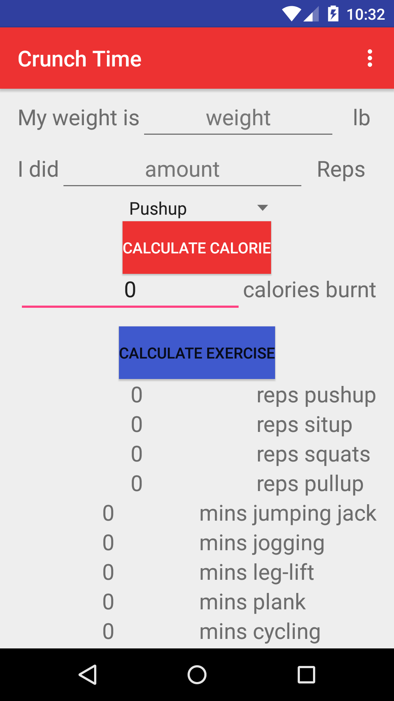

# PROG 01: Crunch Time

This is an exercise-calorie conversion app. It takes the input from users about their weight, amount of exercises and type of exercises they did, and it outputs the calories that users have burned. Also, the app is capable of the reverse way in which the users input weight and amount of calories they want to burn, and then the app will provide the type and amount of exercises our users need to do.

## Authors

Yiyang Shen ([yshen@berkeley.edu](mailto:yshen@berkeley.edu))

## Demo Video

See [Crunch Time] (https://youtu.be/PV3eJ11CW5c)

## Screenshots

## Acknowledgments

* Special thanks to stackoverflow of the amazing community support!
